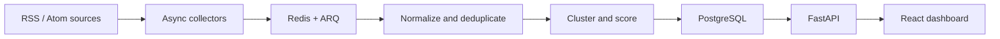

# NewsPulse — Technology News Intelligence Pipeline

NewsPulse is a production-style data pipeline that collects public technology-news metadata, normalizes inconsistent feeds, removes exact duplicates, groups related coverage, and calculates explainable trend scores. Its React dashboard makes every pipeline run and result visible within a short GitHub Codespaces session.

The project stores metadata and publisher-provided excerpts only. Headlines always link to the original publisher.

## Run in GitHub Codespaces

1. Select **Code → Codespaces → Create codespace on main**.
2. If GitHub asks whether you trust the repository, confirm it and wait for the terminal to become available.
3. The development container automatically builds and starts PostgreSQL, Redis, the FastAPI API, the ARQ worker, and the React/Nginx frontend.
4. Wait until the services are healthy: `docker compose ps`.
5. Print the frontend address whenever you are ready:

   ```bash
   bash .devcontainer/show-url.sh
   ```

6. Open the printed URL. If GitHub asks about port visibility, keep it private for personal testing or change port `3000` to public when sharing the running Codespace.

The project intentionally prints the URL instead of automatically opening it. This avoids losing the message or opening a page before GitHub has activated the terminal and port forwarding.

## What to try

Click **Collect latest news**. The API creates a durable run, Redis queues it, and an independent worker collects the configured feeds concurrently. The dashboard reports collected, inserted, duplicate, and failed-source counts while the job runs. On completion, it presents story clusters, trend scores, source diversity, and recent coverage.

External feeds can occasionally be unavailable or rate-limited. A source failure is isolated and shown as pipeline feedback; it does not discard successful results from other sources.

## Architecture



| Layer | Technology | Responsibility |
|---|---|---|
| Frontend | React, TypeScript, Vite, Nginx | Interactive dashboard and run feedback |
| API | FastAPI, Pydantic, SQLAlchemy async | Validation, orchestration and queries |
| Workers | ARQ, Redis, HTTPX | Concurrent collection and background processing |
| Storage | PostgreSQL | Sources, articles, story clusters and run history |
| Runtime | Docker Compose, Dev Containers | Reproducible local and Codespaces environment |
| Quality | Pytest, Ruff, GitHub Actions | Automated validation on pushes and pull requests |

## Documentation

- [Architecture and data flow](docs/architecture.md)
- [Backend and API](docs/backend.md)
- [Collection and intelligence logic](docs/pipeline.md)
- [Frontend](docs/frontend.md)
- [Operations and troubleshooting](docs/operations.md)
- [Testing and engineering decisions](docs/engineering.md)

## Local development

Docker and Docker Compose are the only requirements:

```bash
cp .env.example .env
docker compose up --build
```

- Dashboard: `http://localhost:3000`
- OpenAPI documentation: `http://localhost:8000/api/docs`
- Health endpoint: `http://localhost:8000/health`

Stop services with `docker compose down`. Add `--volumes` only when you intentionally want to delete local PostgreSQL and Redis data.

## Responsible collection

NewsPulse prefers publisher-provided RSS/Atom feeds, identifies itself with a user agent, imposes request timeouts, and limits every run to recent entries. Before enabling a new source, verify its terms, robots policy, attribution expectations, and permitted use. This repository is an educational portfolio project, not a content-republication service.

## License

Licensed under the [MIT License](LICENSE).

