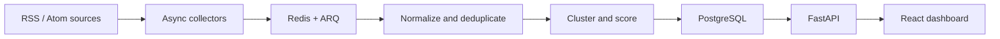

# NewsPulse — Technology News Intelligence Pipeline

NewsPulse is a production-style data pipeline that collects public technology-news metadata, normalizes inconsistent feeds, removes exact duplicates, groups related coverage, and calculates explainable trend scores. Its React dashboard makes every pipeline run and result visible within a short GitHub Codespaces session.

The project stores metadata and publisher-provided excerpts only. Headlines always link to the original publisher.

## Run in GitHub Codespaces

1. Select **Code → Codespaces → Create codespace on main**.
2. If GitHub asks whether you trust the repository, confirm it and wait for the terminal to become available.
3. The development container automatically builds and starts PostgreSQL, Redis, the FastAPI API, the ARQ worker, and the React/Nginx frontend.
4. Wait until the services are healthy: `docker compose ps`.
5. Print the frontend address whenever you are ready:

   ```bash
   bash .devcontainer/show-url.sh
   ```

6. Open the printed URL. If GitHub asks about port visibility, keep it private for personal testing or change port `3000` to public when sharing the running Codespace.

The project intentionally prints the URL instead of automatically opening it. This avoids losing the message or opening a page before GitHub has activated the terminal and port forwarding.

## What to try

Click **Collect latest news**. The API creates a durable run, Redis queues it, and an independent worker collects the configured feeds concurrently. The dashboard reports collected, inserted, duplicate, and failed-source counts while the job runs. On completion, it presents story clusters, trend scores, source diversity, and recent coverage.

The two main actions intentionally behave differently:

- **Collect latest news** contacts the configured sources and executes the complete ingestion pipeline.
- **Refresh dashboard** reloads information already stored in PostgreSQL without contacting publishers.

Run collection more than once to observe idempotency: previously indexed canonical URLs are counted as duplicates, while newly published entries are inserted. Only one collection may run at a time, including when multiple API replicas receive requests concurrently.

External feeds can occasionally be unavailable or rate-limited. A source failure is isolated and shown as pipeline feedback; it does not discard successful results from other sources.

## Architecture



| Layer | Technology | Responsibility |
|---|---|---|
| Frontend | React, TypeScript, Vite, Nginx | Interactive dashboard and run feedback |
| API | FastAPI, Pydantic, SQLAlchemy async | Validation, orchestration and queries |
| Workers | ARQ, Redis, HTTPX | Concurrent collection and background processing |
| Storage | PostgreSQL | Sources, articles, story clusters and run history |
| Runtime | Docker Compose, Dev Containers | Reproducible local and Codespaces environment |
| Quality | Pytest, Ruff, GitHub Actions | Automated validation on pushes and pull requests |

## Processing lifecycle

1. The API stores the collection run before placing work in Redis.
2. The worker downloads enabled RSS/Atom sources concurrently with timeouts and an identifying user agent.
3. Entries are cleaned, validated, converted to UTC, and stripped of common tracking parameters.
4. PostgreSQL uniqueness constraints reject repeated canonical URLs.
5. Significant title tokens group related articles into inspectable story clusters.
6. Recency, coverage volume, and independent-source diversity produce a 0–100 trend score.
7. The dashboard polls only while work is active and stops after completion or failure.

If Redis cannot accept a job, the API marks the persisted run as failed and returns `503`; it never leaves a misleading permanently queued run.

## Key engineering decisions

- **Prefer RSS and Atom feeds:** publisher-provided feeds reduce scraping fragility and make collection boundaries and attribution clearer.
- **Persist a run before enqueueing it:** every requested collection has a durable status, including queue failures, rather than disappearing when Redis is unavailable.
- **Normalize before deduplication:** canonical URLs, UTC timestamps, cleaned text, and removed tracking parameters make uniqueness checks consistent across sources.
- **Enforce idempotency in PostgreSQL:** database constraints remain the final defense against duplicate articles when collections overlap or are retried.
- **Use explainable lexical clustering and scoring:** visitors can understand how recency, volume, and source diversity affect trends without opaque model output.
- **Isolate source failures:** one unavailable or malformed feed does not discard useful results from successful publishers.

## Trade-offs

- RSS/Atom is more respectful and stable than arbitrary page scraping, but exposes only the content and metadata each publisher chooses to provide.
- Lexical similarity is fast and transparent, though it can miss semantically related stories with very different wording.
- Allowing one active collection prevents duplicate concurrent work but limits ingestion throughput.
- PostgreSQL uniqueness constraints guarantee exact canonical-URL deduplication, not identification of every syndicated or rewritten duplicate.
- Polling keeps the frontend implementation simple; server-sent events or WebSockets would reduce repeated status requests at higher usage.

## Documentation

- [Architecture and data flow](docs/architecture.md)
- [Backend and API](docs/backend.md)
- [Collection and intelligence logic](docs/pipeline.md)
- [Frontend](docs/frontend.md)
- [Operations and troubleshooting](docs/operations.md)
- [Testing and engineering decisions](docs/engineering.md)

## Local development

Docker and Docker Compose are the only requirements:

```bash
cp .env.example .env
docker compose up --build
```

- Dashboard: `http://localhost:3000`
- OpenAPI documentation: `http://localhost:8000/api/docs`
- Health endpoint: `http://localhost:8000/health`
- Dependency readiness: `http://localhost:8000/ready`

Stop services with `docker compose down`. Add `--volumes` only when you intentionally want to delete local PostgreSQL and Redis data.

## Repository layout

```text
backend/              FastAPI application, SQLAlchemy models, worker and tests
frontend/             React/TypeScript dashboard and Nginx configuration
.devcontainer/        Automatic Codespaces setup and URL helpers
.github/workflows/    CI checks for backend, frontend and containers
docs/                 Focused design and operating documentation
docker-compose.yml    Complete local service topology
```

## Verification

CI executes the following on pushes, pull requests, and manual runs:

- Ruff static analysis and Pytest backend tests;
- ESLint, Vitest and a strict TypeScript production build;
- production dependency vulnerability audit;
- Docker Compose validation and complete image builds.

No API keys or external credentials are required. Development database credentials in `.env.example` are intentionally local-only defaults. Runtime data stays in Docker volumes and can be removed using the documented reset command.

## Scope and limitations

This is a short-session portfolio demonstration, not a hosted news service. It uses transparent lexical similarity rather than claiming semantic or causal certainty. Feed availability, metadata completeness, publication timestamps, and publisher terms remain external constraints. Authentication, tenant isolation, distributed rate limiting, schema migrations, and semantic embeddings would be required or considered before a shared production deployment.

## Responsible collection

NewsPulse prefers publisher-provided RSS/Atom feeds, identifies itself with a user agent, imposes request timeouts, and limits every run to recent entries. Before enabling a new source, verify its terms, robots policy, attribution expectations, and permitted use. This repository is an educational portfolio project, not a content-republication service.

## License

Licensed under the [MIT License](LICENSE).
